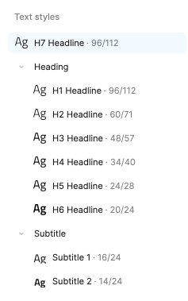

# Typography (タイポグラフィ)

There are 12 text (character) styles in the **Indigo.Design System** that constitute its typography and let you set up your theme's typeface. デフォルトで [Titillium Web](https://fonts.google.com/specimen/Titillium+Web) を使用していますが、すべてのデザイナーがアプリケーションを柔軟にカスタマイズできるようにする必要があります。Indigo.Design follows the way typography is defined in the [Material Type System](https://material.io/design/typography/the-type-system.html#type-scale) and complies with the implementation of the [Ignite UI for Angular Typography](https://jp.infragistics.com/products/ignite-ui-angular/angular/components/themes/typography).

In Sketch, these can be found on a separate page named `🎨 Typography` and are available as `Text Styles` that can be applied to any text element. In Adobe XD they are placed on an Artboard with the same name in the left column of the library file and exist as `Character Styles` that are used across components and patterns.

## Typography のスタイル

To use the typography system in your project, all you need to do is apply one of the text (character) styles defined in the library to a native text element. Sketch offers a vast selection of type presets with different sizes, colors, and alignments, while Adobe XD defines only the size and lets you adjust the alignment and apply a color style.

- タイトルの `H1` から `H6` までの 6 つの見出し。
- 2 つの `Subtitle` サイズ。
- 2 インターフェイスの段落コンテンツの `Body` サイズ。
- 無料のコンテンツに使用できる `Caption` と `Overline` スタイル。
- A `BUTTON` style that is used exclusively in the Button components

記事、ブログ投稿などの高度なレイアウトを作成する場合に使用します。**Indigo.Design システム**のタイポグラフィは、デザインのすべてのテキストに一貫性のあるテーマとスタイルを定義します。

> [!Warning]
> In Sketch, there is also a collection of `Internal` text styles used within the Components for validation and special cases. These styles are not supposed to be inserted on your artboards directly but exist to assure typographic consistency for the Components within which they are used.

## Component Specific Typography

Components, such as [Avatar](../components/avatar.md), [Button](../components/button.md), [Grid](../components/grid.md), [Slider](../components/slider.md) and [Tooltip](../components/tooltip.md) use component-specific Typography to accommodate the specifics of the styling used by the respective component e.g. the Avatar with initials and Button use an all caps style. Below you can find the text styles defined for the Avatar in Sketch to allow more versatile usage of font colors.

## Typography Color Variants in Sketch

In Sketch, the text styles include the text color, thus each one comes in multiple preset colors, such as `active` corresponding to `grays.900`, `inactive` corresponding to `grays.700`, `disabled` corresponding to `grays.500`, `white` and `secondary`. There are also scales with special colors for strings that need to be in `success`, `warn`, and `error` colors, as well as some additional nuances used by the Indigo.Design Components.

## Sketch で書体を変更

Sketch で Titillium Web から別の書体に書体を変更するには、Indigo.Design ライブラリ ファイルを開き、`View` / `Components` を選択します。Sketch メニューに 4 つのボタンのグループがあります。2 つ目のボタンは文字アイコンで、`Show Text Styles` 表します。

選択後、**Indigo.Design システム**が定義するすべてのテキスト スタイルを参照できます。左側のパネルで `All Text Styles` が選択されていることを確認し、Sketch の中央部分をクリックして `command` + `A` を押してすべてのスタイルを選択します。

右側のパネルにあるすべての `Text Styles` に別の書体を選択できるドロップダウンがあります。これで設定が完了し、変更はすべての `Text Styles` を更新するだけでなく、すべてのコンポーネントとパターンに自動的に反映されます。

Sketch の `Text Styles` はカラー変数を使用してテキストの color プロパティを定義します。したがって、[Colors](colors.md) のトピックで説明されている手順に従って `primary` カラーを変更すると、すべてのプライマリ `Text Styles` が自動的に更新されます。

## Adobe XD で書体を変更

To change the typeface from Titillium Web to another one in Adobe XD open the Indigo.Design library file and select the `Libraries` panel. Then scroll to `Character Styles` right-click on one of them, and from the contextual menu that appears, choose `Edit`. In the popover, there is a dropdown at the top, allowing you to choose another font family. Note that you have to perform the same steps for every style individually to amend this change for all of your typography.

## カスタム Typography の作成

The typographic variety of styles should be more than sufficient to let you design various user interfaces. However, you may occasionally need to create an extra style for a special use case. If you want to define it globally for all your projects, do it in the Indigo.Design library. If it is something meaningful only within the scope of your current project, do it in the project file instead.

### Sketch で
Start by inserting a new `Text` layer and assign to it the closest `Text Style` from the existing ones fed from the library via the `Appearance` panel.

Next, make the adjustments like changing the text color to a different color variables, for example.

Last, click the Create button and give the new style an appropriate name and you are all set.

### Adobe XD で
Start by inserting a new `Text` layer and adjust its properties on the right panel under `Text`. For example, choose a different font, size, alignment, and set an all lower case style.

Then, in the `Libraries` panel, click on the `+` icon to the right of `Character Styles` to create the style and give it an appropriate name.

## その他のリソース

関連トピック:

- [Colors](colors.md)
- [Avatar](../components/avatar.md)
- [Button](../components/button.md)
- [Grid](../components/grid.md)
- [Slider](../components/slider.md)
- [Tooltip](../components/tooltip.md)
  

コミュニティに参加して新しいアイデアをご提案ください。
