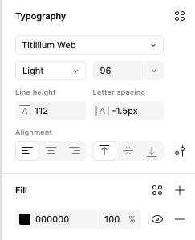

# タイポグラフィ

**Indigo.Design システム**の `🎨 Typography` ページには、テーマの書体を設定できるタイプ スケールのコレクションがあります。デフォルトで [Titillium Web](https://fonts.google.com/specimen/Titillium+Web) を使用していますが、すべてのデザイナーがアプリケーションを柔軟にカスタマイズできるようにする必要があります。Indigo.Design タイポグラフィは、[マテリアル タイプ システム](https://material.io/design/typography/the-type-system.html#type-scale)で定義された定義 と [Ignite UI for Angular タイポグラフィ](https://jp.infragistics.com/products/ignite-ui-angular/angular/components/themes/typography)の実装に従います。

プロジェクトでタイポグラフィを使用するには、ライブラリで定義されたテキスト スタイルの 1つ を任意のテキストレイヤーに適用します。サイズ、カラー、配置などさまざまなタイプのプリセットがあります。

- タイトルの `H1` から `H6` までの 6 つの見出し。
- 2 つの `Subtitle` サイズ。
- 2 インターフェイスの段落コンテンツの `Body` サイズ。
- 無料のコンテンツに使用できる `Caption` と `Overline` スタイル。

記事、ブログ投稿などの高度なレイアウトを作成する場合に使用します。**Indigo.Design システム**のテキスト スタイルは、デザインのすべてのテキストに一貫性のあるテーマとスタイルを定義します。

> [!Warning]
> コンポーネント内で検証のために使用される `Internal` スタイルのコレクション、ボタンのラベルなどの特殊なケース、およびグリッドのようなデータ密度の高いシナリオもあります。これらのスタイルは、インターフェイスに直接挿入する必要はありませんが、使用されるコンポーネントのタイポグラフィの一貫性を確保するために存在します。

## タイポグラフィ カラー

タイポグラフィには、`grays.900` に対応する `active`、`grays.700` に対応する `inactive`、`grays.500` に対応する `disabled`、`white`、`secondary` など、複数のプリセット カラーがあります。`success`、`warn`、および `error` カラーが必要な文字列の特別なカラーのタイプ スケールがあり、Indigo.Design コンポーネント固有のバリアントもあります。

## コンポーネント固有のタイポグラフィ

[Avatar](../components/avatar.md)、[Button](../components/button.md)、[Grid](../components/grid.md)、[Slider](../components/slider.md) および [Tooltip](../components/tooltip.md) などのコンポーネントは、コンポーネント固有のタイポグラフィを使用して、各コンポーネントで使用されるスタイル設定に対応します。たとえば、Avatar にはさまざまなカラーが必要で、Button はすべて大文字のスタイルを使用します。

## 書体の変更

Sketch で Titillium Web から別の書体に書体を変更するには、Indigo.Design ライブラリ ファイルを開き、`View` > `Components` を選択します。Sketch メニューに 4 つのボタンのグループがあります。2 つ目のボタンは文字アイコンで、`Show Text Styles` 表します。

選択後、**Indigo.Design システム**が定義するすべてのテキスト スタイルを参照できます。左側のパネルで `All Text Styles` が選択されていることを確認し、Sketch の中央部分をクリックして `command` + `A` を押してすべてのスタイルを選択します。

右側のパネルにあるすべての `Text Styles` に別の書体を選択できるドロップダウンがあります。これで設定が完了し、変更はすべての `Text Styles` を更新するだけでなく、すべてのコンポーネントとパターンに自動的に反映されます。

Sketch の `Text Styles` はカラー変数を使用してテキストの color プロパティを定義します。したがって、[カラーのトピック](colors.md)で説明されている手順に従って `primary` カラーを変更すると、すべてのプライマリ `Text Styles` が自動的に更新されます。

## カスタム タイポグラフィの作成

さまざまなタイプスケールや `Text Styles` は、さまざまなユーザー インターフェイスをデザインするのに十分です。ただし、特別なカラーの見出しに追加のスタイルを作成する必要がある場合があります。すべてのプロジェクトでグローバルに定義する場合、既存の見出しから複製を作成し、適切なカラーを選択して名前を付けます。現在のプロジェクトのスコープ内でのみ意味がある場合は、Sketch に新しい `Text` レイヤーを挿入します。ライブラリから `Appearance` パネルで供給された既存のテキスト スタイルに最も近い `Text Style` を割り当てます。

次に、テキストのカラーを別のカラー変数に変更するなどの調整を行います。

最後に、Create ボタンをクリックし、新しいスタイルに適切な名前を付けます。

## その他のリソース

関連トピック:

- [カラー](colors.md)
- [Avatar](../components/avatar.md)
- [Button](../components/button.md)
- [Grid](../components/grid.md)
- [Slider](../components/slider.md)
- [Tooltip](../components/tooltip.md)
  

コミュニティに参加して新しいアイデアをご提案ください。
