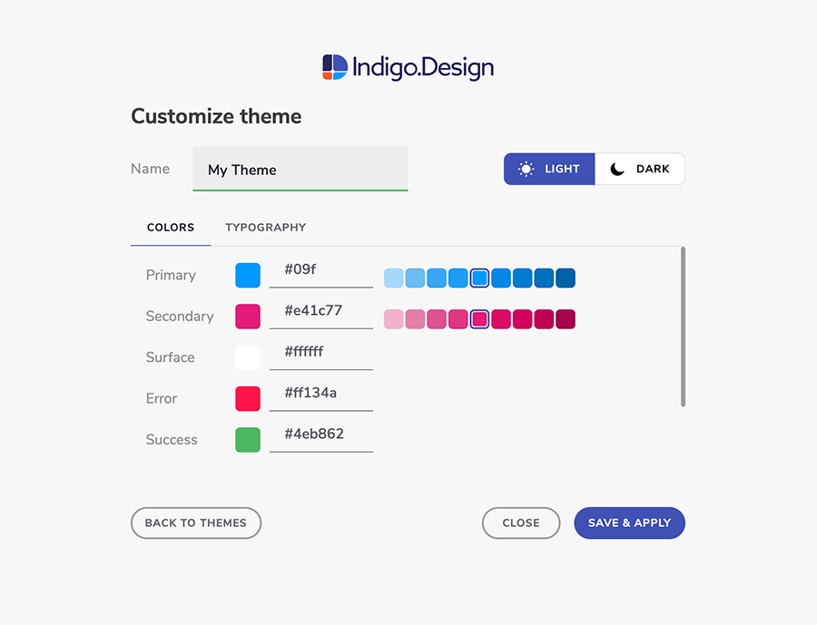
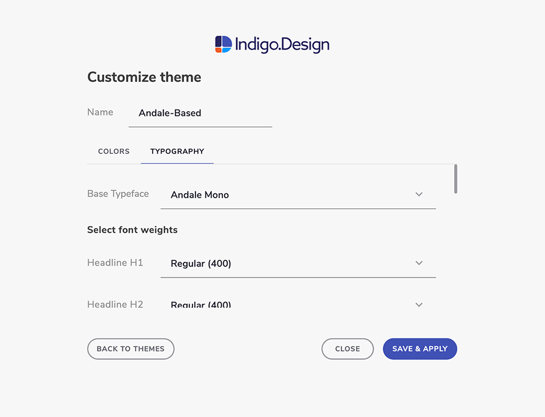
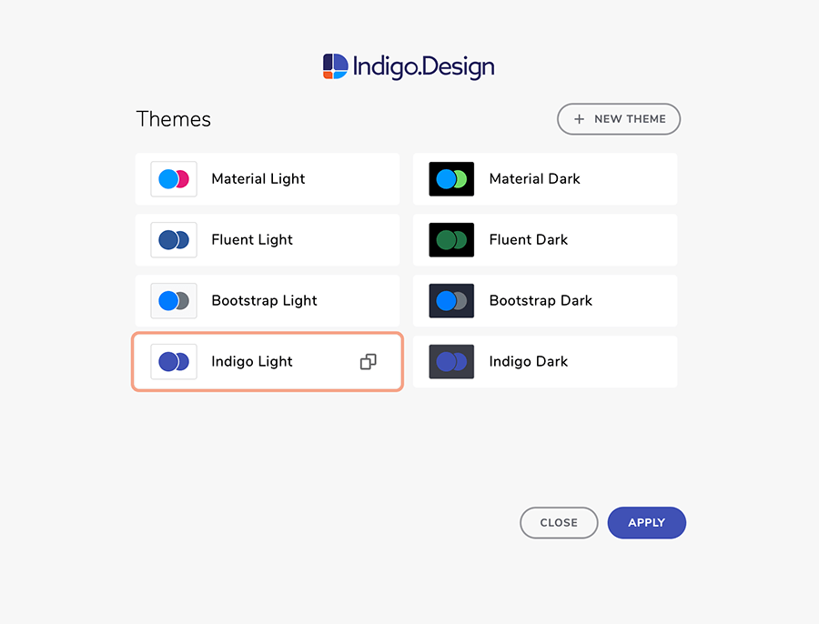
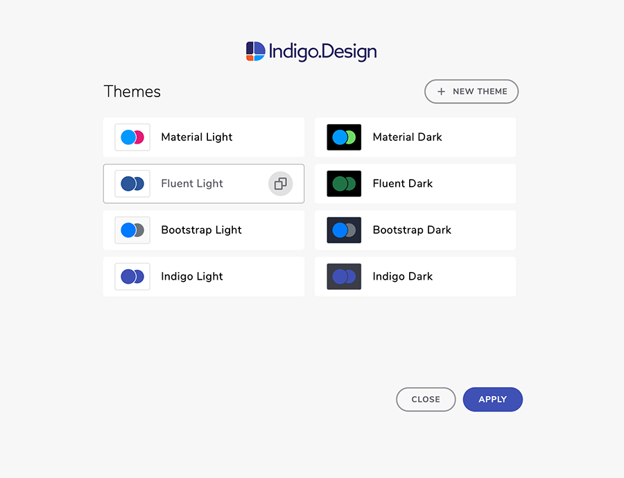
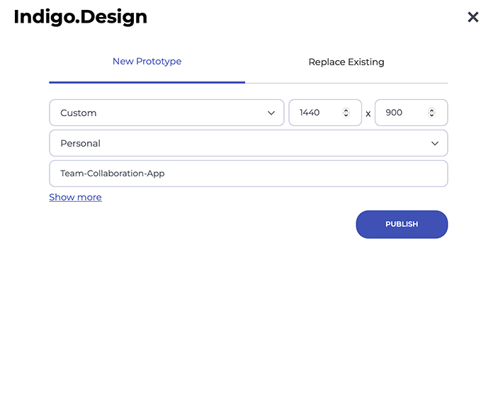

# Indigo.Design プラグイン

Indigo.Design Sketch プラグインを使用すると、デザインのテーマを作成および編集し、これらのデザインから Indigo.Cloud でアプリやプロトタイプをすばやく作成して公開できます。

Indigo.Design System を使用して Sketch のデザインを作成したら、プラグインを使用して次の操作を行います。

-  Indigo.Design AppBuilder でアプリをすばやく作成します。このアプリは、Sketch デザインの構造に従い、Indigo.Design UI  Kit のシンボルを Ignite UI の対応するコンポーネントにマッピングします。プラグインはまた、Sketch で使用されている画像を取得し、[`Assets` サポート (英語)](https://www.infragistics.com/community/blogs/b/jason_beres/posts/indigo-design-app-builder-october-release-with-assets-support) を使用して App Builder の下の Assets ライブラリにアップロードします。 

- Indigo.Design UI Kit for Sketch を使用する場合は、新しいテーマを作成し、既存のテーマを編集します。ユーザーは、ブランドの特性に応じて、`primary`、`secondary`、`error`、`success`、`warn`、`info` の色およびタイポグラフィのプロパティを調整できます。作成したテーマは、デザインからアプリを作成すると、Indigo.Design App Builder に表示されます。

- プロトタイプを Indigo.Design Cloud に簡単に公開し、その後、変更や更新を行うときに定期的に同期します。

## 1. Indigo.Design プラグインのインストール

Indigo.Design プラグインは、ヘッダーの `作業の開始` ボタンをクリックすると表示されるダイアログの `Design System` タブからサインインした後に [Indigo.Design Cloud](https://cloud.indigo.design) からダウンロードできます。アーカイブをダウンロードして開き、Sketch プラグイン ファイルをダブルクリックすると、Indigo.Design プラグインがインストールされます。

Indigo.Design リソース

## 2. App Builder でアプリケーションを作成します
デザインを取り入れて、実際の UI コンポーネントとスタイル設定を備えたインタラクティブでレスポンシブなアプリを作成します。`Create App` タブを使用すると、プラグインが Sketch デザインを App Builder の下の実際のアプリケーションに変換し、Sketch で使用した画像やテーマにアクセスできるようにします。これらはすべてクラウドで直接行われます。

プラグインを使用すると、アプリの名前と解像度を選択したり、アプリが作成される Indigo.Design Cloud ワークスペースを選択したりできます。

## 3. テーマ

このセクションでは、Indigo.Design UI Kit で作成した Sketch プロジェクトでテーマを作成する際のベスト プラクティスについて説明します。以下の方法に従ってタイポグラフィや色などブランディング アセットをプロジェクトやライブラリに適用できます。複数のプロジェクト内のすべての UI コンポーネントで統一したブランディングを表現できます。

### テーマ構成の起動

Sketch の `Plugins` メニューの `Indigo.Design` から `Themes` を選択します。モーダルで表示されるテーマの 1 つを選択して必要に応じて調整、あるいは新しいテーマを作成します。

### テーマの新規作成

ブランディングに基づいてテーマをビルドし、テーマ コレクションに追加する場合は、`新しい テーマ`を選択して色やタイポグラフィを必要に応じて調整します。デフォルトの値は、[Ignite UI for Angular](https://jp.infragistics.com/products/ignite-ui-angular) の [デフォルトのテーマ](https://jp.infragistics.com/products/ignite-ui-angular/angular/components/themes/examples.html#デフォルト-テーマ)と同じです。

#### 1. 新しいテーマに名前を付ける

Colors や Typography プロパティを編集する前にテーマの名前を指定します。テーマの説明となる名前を付けるとテーマが増えたときにわかりやすく便利です。

#### 2. ブランディングと色の選択

上部にある 2 つのパレットを指定する場合、残りのシェードが自動的に生成されるためベース値 `Primary 500` と `Secondary 500` のみ設定できます。ほとんどの場合、ブランディング カラーのパレットを使用します。`Error`、`Success`、`Warning`、`Info` の色に関しては、アプリケーションに対するユーザーの知覚を考慮することをお勧めします。デフォルトの色は、ほとんどのケースにマッチする色になっています。テーマをクリックし、HEX/RGB 値を入力、または色を選択して簡単に調整できます。

#### 3. タイポグラフィの選択

Typeface プロパティは、`タイポグラフィ`タブで設定できます。`Base Typeface` としてよく使用されるフォントファミリなどが設定できます。追加で各テキスト スタイルのフォントの太さを調整する場合もプラグインで行うことができます。テキストのスタイルは線や段落、更に Chipa など内部にテキストを表示するコンポーネントにも適用されます。

#### 4. テーマの保存と適用

[保存] をクリックするとテーマが保存され、定義済みテーマの一覧に表示されます。ライブラリが更新されてスタイルが現在のプロジェクトにプロパゲートされると、ライブラリと Sketch ファイルのサイズにもよりますが処理は通常数秒で終わります。

### 既存のテーマの使用

テーマの作成は簡単ですが、既存テーマ (デフォルトまたはカスタム) の再利用はより簡単です。テーマは 1 クリックで選択できる以外に適用する前に調整することも可能です。あるいはプラグインのコレクションをクリーンアップするために削除することもできます。

#### テーマの編集

既存のテーマを適用する前に調整する場合は、上記のテーマの作成セクションで説明したエントリをいくつか設定できます。

> [!Note]
> `Error`、`Success`、`Warning`、`Info` の色がブランディング カラーや `Primary` と `Secondary` のために生成したパレットと区別できるようにします。
>
> 

## 4. クラウドへのプロトタイプの公開と同期

Indigo.Design クラウドにプロトタイプを公開する準備ができたら Sketch の `Plugins` メニューから `Indigo.Design` / `Publish Prototype` を選択します。プラグインのクラウド インテグレーション機能をはじめて実行する場合、Indigo.Design アカウントでログインする必要があります。プロトタイプを公開する際場合、はじめに新しいプロトタイプを作成するか既存のプロトタイプを置き換えるかを選択してください。

### 新しいプロトタイプの公開

共有したい Sketch プロジェクトがある場合、Indigo.Design クラウドへ公開して早い段階でフィードバックをもらうことができます。`新しいプロトタイプ`タブで実行でき、以下が可能です。

- デバイス タイプと解像度の選択 (デフォルトでアートボードと一致する必要があります)
- プロトタイプをパーソナルまたはチーム ワークスペースに公開するかどうかを選択
- プロトタイプの名前を提供 (デフォルトで Sketch プロジェクト ファイルの名前と一致)
- 簡単な説明文の追加 (オプション)
- プロトタイプのパスワード保護
- ホットスポットとインタラクションの強調表示を選択
- デザインにコメントを許可

[公開] ボタンをクリックするとプロジェクトが Indigo.Design Cloud へアップロードされます。これによりフィードバックをもらったり[コードを生成](codegen/vscode-plugin.md)したりすることができます。

### 既存プロトタイプの更新

新しいプロトタイプを公開する他、クラウドにあるスクリーンをより新しいスクリーンと置き換えて既存のプロトタイプを更新することもできます。`保存プロトタイプと置き換え`タブへ移動し、プロトタイプの検索やフィルタリングができます (パーソナルまたはチームワークスペースにある場合など)。作成時に定義したプロトタイプの構成を変更することもできます。

- デバイスタイプと解像度
- 名前
- ワークスペース
- 簡単な説明
- パスワード
- ホットスポットとインタラクションのハイライト
- コメント

### プロトタイプの公開

プロトタイプがクラウドへ正しく公開されるとリンクの他に以下のオプションがあります。

- ブラウザ ウィンドウでワークスペースを閲覧
- ユーザビリティ テストを作成し、[ユーザー テスト](prototyping/set-up-a-user-test.md)を初期化してブラウザーで開く
- クリップボードにプロトタイプのリンクをコピーしてメールで送信、またはコードを生成

プラグイン ダイアログで完了をクリックすると引き続き Sketch でデザインできます。

### プロトタイプの同期

プロトタイプを最初に公開した後もデザイン フローが継続されるため、細かな調整や公開したプロトタイプと同期する必要があります。[Plugins] メニューから `Sync Prototype` を選択します。

これにより現在のプロジェクトを前回公開したプロトタイプへ公開します。進捗状況がダイアログで表示されます。プロトタイプが正しく同期されると通知が表示されて、数秒後にダイアログが自動的に閉じられます。

## その他のリソース

関連トピック:

- [Colors](./style/colors.md)
- [Typography](./style/typography.md)

コミュニティに参加して新しいアイデアをご提案ください。
